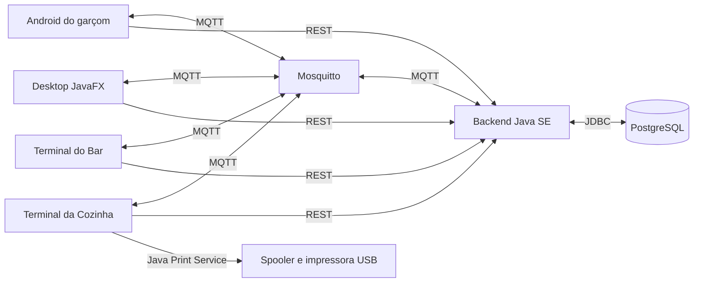
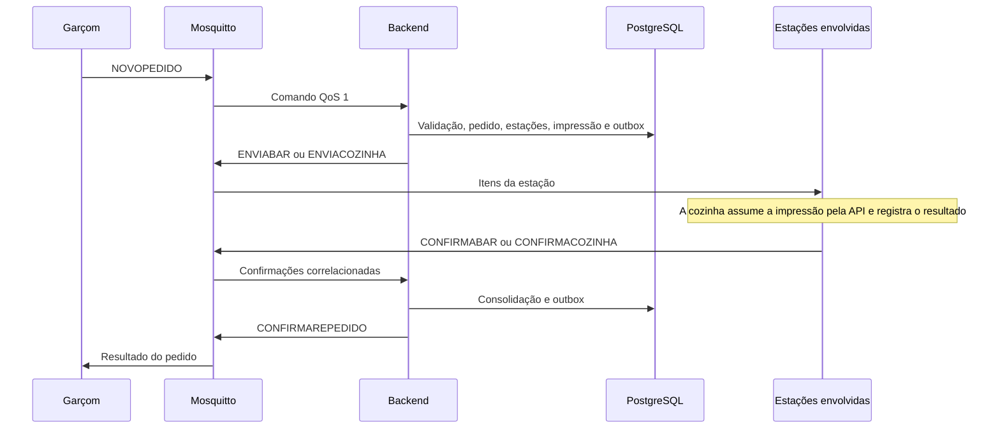

# Componentes e fluxo principal

```mermaid
flowchart LR
    G[Android do garçom]
    D[Desktop JavaFX]
    B[Terminal do Bar]
    C[Terminal da Cozinha]
    M[Mosquitto]
    A[Backend Java SE]
    P[(PostgreSQL)]
    I[Spooler e impressora USB]

    G <-->|MQTT| M
    D <-->|MQTT| M
    B <-->|MQTT| M
    C <-->|MQTT| M
    M <-->|MQTT| A
    G -->|REST| A
    D -->|REST| A
    B -->|REST| A
    C -->|REST| A
    A <-->|JDBC| P
    C -->|Java Print Service| I
```

```mermaid
sequenceDiagram
    participant G as Garçom
    participant M as Mosquitto
    participant A as Backend
    participant P as PostgreSQL
    participant E as Estações envolvidas
    G->>M: NOVOPEDIDO
    M->>A: Comando QoS 1
    A->>P: Validação, pedido, estações, impressão e outbox
    A->>M: ENVIABAR ou ENVIACOZINHA
    M->>E: Itens da estação
    Note over E: A cozinha assume a impressão pela API e registra o resultado
    E->>M: CONFIRMABAR ou CONFIRMACOZINHA
    M->>A: Confirmações correlacionadas
    A->>P: Consolidação e outbox
    A->>M: CONFIRMAREPEDIDO
    M->>G: Resultado do pedido
```
